Component selection

EGR 314

Team 302

Tyler Winder, Sam Kohler, Jose Nava-Mesina,Tilak Raj Thanga Raj

**Wind sensor**

**External ADC**

<table>
<colgroup>
<col style="width: 33%" />
<col style="width: 33%" />
<col style="width: 33%" />
</colgroup>
<thead>
<tr class="header">
<th>Solution</th>
<th>Pros</th>
<th>Cons</th>
</tr>
<tr class="odd">
<th></th>
<th><ul>
<li><blockquote>

Cheapest option of the three

</blockquote></li>
</ul></th>
<th><ul>
<li><blockquote>

Only has one channel

</blockquote></li>
</ul></th>
</tr>
<tr class="header">
<th>Option 1</th>
<th><ul>
<li><blockquote>

Best range in input voltage

</blockquote></li>
</ul></th>
<th><ul>
<li><blockquote>

Out of range alert feature may cause problems

</blockquote></li>
</ul></th>
</tr>
<tr class="odd">
<th>ADC081C027 8-Bit, 189kSPS, 1-Ch SAR ADC with I2C</th>
<th><ul>
<li><blockquote>

Uses I2C

</blockquote></li>
</ul></th>
<th><ul>
<li><blockquote>

May not handle az heat

</blockquote></li>
</ul></th>
</tr>
<tr class="header">
<th colspan="3">$1.141/each</th>
</tr>
<tr class="odd">
<th colspan="3"><a href="https://www.ti.com/product/ADC081C027#order-quality"><u>link</u></a></th>
</tr>
</thead>
<tbody>
</tbody>
</table>

<table>
<colgroup>
<col style="width: 33%" />
<col style="width: 33%" />
<col style="width: 33%" />
</colgroup>
<thead>
<tr class="header">
<th>Solution</th>
<th>Pros</th>
<th>Cons</th>
</tr>
<tr class="odd">
<th>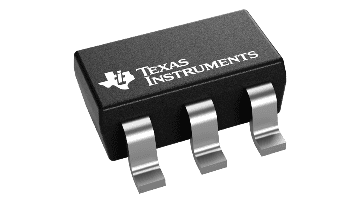</th>
<th><ul>
<li><blockquote>

Has the highest sample rate

</blockquote></li>
</ul></th>
<th><ul>
<li><blockquote>

Does not have as large sampling range

</blockquote></li>
</ul></th>
</tr>
<tr class="header">
<th>Option 2</th>
<th><ul>
<li><blockquote>

Has an auto power-down mode when not receiving data

</blockquote></li>
</ul></th>
<th><ul>
<li><blockquote>

Temperature range not as high as would like

</blockquote></li>
</ul></th>
</tr>
<tr class="odd">
<th>
ADS7827

5.25V-2.7V, 8 bit, 250 KSPS, Synchronous Serial ADC
</th>
<th><ul>
<li><blockquote>

Uses I2C

</blockquote></li>
</ul></th>
<th><ul>
<li><blockquote>

Uses an external reference

</blockquote></li>
</ul></th>
</tr>
<tr class="header">
<th colspan="3">$1.879/each</th>
</tr>
<tr class="odd">
<th colspan="3"><a href="https://www.ti.com/product/ADS7827"><u>link</u></a></th>
</tr>
</thead>
<tbody>
</tbody>
</table>

<table>
<colgroup>
<col style="width: 33%" />
<col style="width: 33%" />
<col style="width: 33%" />
</colgroup>
<thead>
<tr class="header">
<th>Solution</th>
<th>Pros</th>
<th>Cons</th>
</tr>
<tr class="odd">
<th>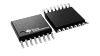</th>
<th><ul>
<li><blockquote>

HaUses I2C more channels can be used for both sensors

</blockquote></li>
</ul></th>
<th><ul>
<li><blockquote>

Highest power consumption of the three

</blockquote></li>
</ul></th>
</tr>
<tr class="header">
<th>Option 3</th>
<th><ul>
<li><blockquote>

Has three different modes

</blockquote></li>
</ul></th>
<th><ul>
<li><blockquote>

Most expensive

</blockquote></li>
</ul></th>
</tr>
<tr class="odd">
<th>
ADS7830

8-Bit, 8-Channel Sampling A/D Converter with I2C Interface
</th>
<th><ul>
<li><blockquote>

Uses I2C

</blockquote></li>
</ul></th>
<th><ul>
<li><blockquote>

Large footprint

</blockquote></li>
</ul></th>
</tr>
<tr class="header">
<th colspan="3">$2.333/each</th>
</tr>
<tr class="odd">
<th colspan="3"><a href="https://www.ti.com/product/ADS7830"><u>link</u></a></th>
</tr>
</thead>
<tbody>
</tbody>
</table>

**Choice:** option 1: ADC081C027 8-Bit, 189kSPS, 1-Ch SAR ADC with I2C

**Rationale:** This ADC has the best input voltage range, temperature
range, and is the cheapest of the three.

**Op amp**

<table>
<colgroup>
<col style="width: 33%" />
<col style="width: 33%" />
<col style="width: 33%" />
</colgroup>
<thead>
<tr class="header">
<th>Solution</th>
<th>Pros</th>
<th>Cons</th>
</tr>
<tr class="odd">
<th>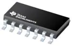</th>
<th><ul>
<li><blockquote>

Has multiple channels so could use both sensors

</blockquote></li>
</ul></th>
<th><ul>
<li><blockquote>

Very expensive

</blockquote></li>
</ul></th>
</tr>
<tr class="header">
<th>Option 1</th>
<th><ul>
<li><blockquote>

Great operating temp

</blockquote></li>
</ul></th>
<th><ul>
<li><blockquote>

Overly large footprint

</blockquote></li>
</ul></th>
</tr>
<tr class="odd">
<th>OPA4991MDYYREP</th>
<th><ul>
<li><blockquote>

Has the highest slew rate

</blockquote></li>
</ul></th>
<th><ul>
<li><blockquote>

Will have unused channels

</blockquote></li>
</ul></th>
</tr>
<tr class="header">
<th colspan="3">$10.10/each</th>
</tr>
<tr class="odd">
<th colspan="3"><a href="https://www.mouser.com/ProductDetail/Texas-Instruments/OPA4991MDYYREP?qs=IPgv5n7u5QYEXhSvfh2heg%3D%3D"><u>link</u></a></th>
</tr>
</thead>
<tbody>
</tbody>
</table>

<table>
<colgroup>
<col style="width: 33%" />
<col style="width: 33%" />
<col style="width: 33%" />
</colgroup>
<thead>
<tr class="header">
<th>Solution</th>
<th>Pros</th>
<th>Cons</th>
</tr>
<tr class="odd">
<th></th>
<th><ul>
<li><blockquote>

Has two channels

</blockquote></li>
</ul></th>
<th><ul>
<li><blockquote>

Has the lowest slew rate

</blockquote></li>
</ul></th>
</tr>
<tr class="header">
<th>Option 2</th>
<th><ul>
<li><blockquote>

Has the lowest minimum supply voltage

</blockquote></li>
</ul></th>
<th><ul>
<li><blockquote>

Has a lower bandwidth

</blockquote></li>
</ul></th>
</tr>
<tr class="odd">
<th>OPA2310IDR</th>
<th><ul>
<li><blockquote>

Has a good output current

</blockquote></li>
</ul></th>
<th><ul>
<li><blockquote>

Bigger footprint

</blockquote></li>
</ul></th>
</tr>
<tr class="header">
<th colspan="3">$1.22/each</th>
</tr>
<tr class="odd">
<th colspan="3"><a href="https://www.mouser.com/ProductDetail/Texas-Instruments/OPA2310IDR?qs=vvQtp7zwQdO7M4WMfM7rQg%3D%3D"><u>link</u></a></th>
</tr>
</thead>
<tbody>
</tbody>
</table>

<table>
<colgroup>
<col style="width: 33%" />
<col style="width: 33%" />
<col style="width: 33%" />
</colgroup>
<thead>
<tr class="header">
<th>Solution</th>
<th>Pros</th>
<th>Cons</th>
</tr>
<tr class="odd">
<th>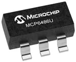</th>
<th><ul>
<li><blockquote>

Cheapest option

</blockquote></li>
</ul></th>
<th><ul>
<li><blockquote>

Only one channel

</blockquote></li>
</ul></th>
</tr>
<tr class="header">
<th>Option 3</th>
<th><ul>
<li><blockquote>

Smallest size

</blockquote></li>
</ul></th>
<th><ul>
<li><blockquote>

Not a very good output current

</blockquote></li>
</ul></th>
</tr>
<tr class="odd">
<th>MCP6486UT-E/OT</th>
<th><ul>
<li><blockquote>

Faster bandwidth

</blockquote></li>
</ul></th>
<th><ul>
<li><blockquote>

High offset voltage

</blockquote></li>
</ul></th>
</tr>
<tr class="header">
<th colspan="3">$0.31/each</th>
</tr>
<tr class="odd">
<th colspan="3"><a href="https://www.mouser.com/ProductDetail/Microchip-Technology-Atmel/MCP6486UT-E-OT?qs=tlsG%2FOw5FFghOa1qGRyozQ%3D%3D"><u>link</u></a></th>
</tr>
</thead>
<tbody>
</tbody>
</table>

**Choice:** option 2: OPA2310IDR

**Rationale:** The reason we are choosing this one is it does have two
channels which we can use both sensors through it, and all of its cons
are still within the range of our product.

**DC Generator**

<table>
<colgroup>
<col style="width: 33%" />
<col style="width: 33%" />
<col style="width: 33%" />
</colgroup>
<thead>
<tr class="header">
<th>Solution</th>
<th>Pros</th>
<th>Cons</th>
</tr>
<tr class="odd">
<th>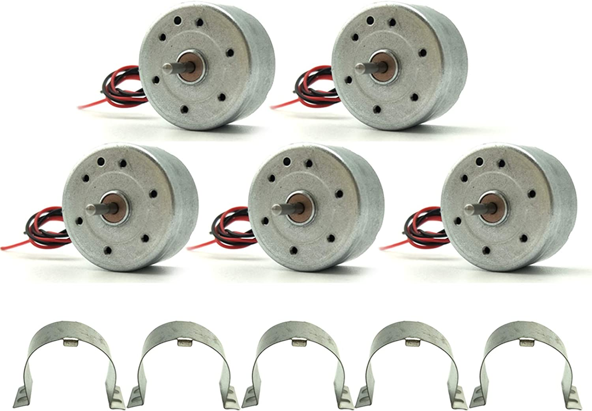</th>
<th><ul>
<li><blockquote>

Contains a holder

</blockquote></li>
</ul></th>
<th><ul>
<li><blockquote>

Most expensive

</blockquote></li>
</ul></th>
</tr>
<tr class="header">
<th>Option 1</th>
<th><ul>
<li><blockquote>

Strong wire connections

</blockquote></li>
</ul></th>
<th><ul>
<li><blockquote>

Have to buy 5 at a time

</blockquote></li>
</ul></th>
</tr>
<tr class="odd">
<th>EUDAX Mini Generator Motors 3V-12V DC Motor</th>
<th><ul>
<li><blockquote>

1500 rpm at 3v

</blockquote></li>
</ul></th>
<th><ul>
<li><blockquote>

Can generate power up to 12 v

</blockquote></li>
</ul></th>
</tr>
<tr class="header">
<th colspan="3">$2.00/each</th>
</tr>
<tr class="odd">
<th colspan="3"><a href="https://www.amazon.com/dp/B07CJNXTV1/ref=sspa_dk_detail_0?psc=1&amp;pd_rd_i=B07CJNXTV1&amp;pd_rd_w=vXNZk&amp;content-id=amzn1.sym.88097cb9-5064-44ef-891b-abfacbc1c44b&amp;pf_rd_p=88097cb9-5064-44ef-891b-abfacbc1c44b&amp;pf_rd_r=D82NBFZQH7Z37WH6K6B1&amp;pd_rd_wg=5fFCc&amp;pd_rd_r=a4746478-b933-4151-a5fb-fb326a07dfd1&amp;s=toys-and-games&amp;sp_csd=d2lkZ2V0TmFtZT1zcF9kZXRhaWw&amp;spLa=ZW5jcnlwdGVkUXVhbGlmaWVyPUEyUEFYR0NJTjJXSlhDJmVuY3J5cHRlZElkPUEwMTc3NzkwMjRFWkpQSjFNWEQxSyZlbmNyeXB0ZWRBZElkPUEwOTE5OTI0MURRWkJRSjExRkFHWiZ3aWRnZXROYW1lPXNwX2RldGFpbCZhY3Rpb249Y2xpY2tSZWRpcmVjdCZkb05vdExvZ0NsaWNrPXRydWU="><u>link</u></a></th>
</tr>
</thead>
<tbody>
</tbody>
</table>

<table>
<colgroup>
<col style="width: 33%" />
<col style="width: 33%" />
<col style="width: 33%" />
</colgroup>
<thead>
<tr class="header">
<th>Solution</th>
<th>Pros</th>
<th>Cons</th>
</tr>
<tr class="odd">
<th>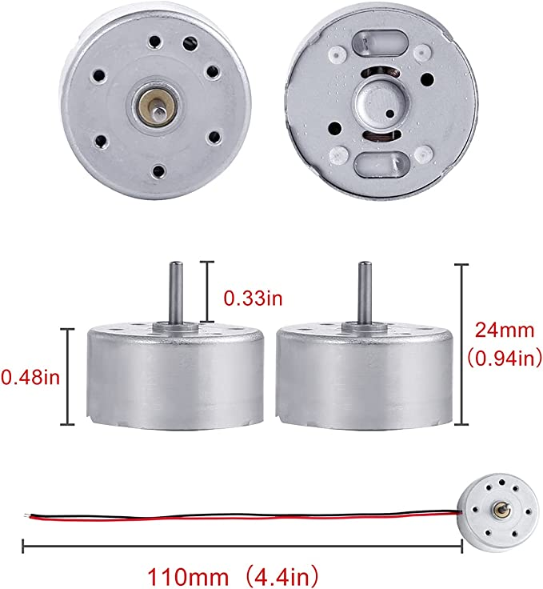</th>
<th><ul>
<li><blockquote>

Contain a holder

</blockquote></li>
</ul></th>
<th><ul>
<li><blockquote>

Can generate power up to 12 v

</blockquote></li>
</ul></th>
</tr>
<tr class="header">
<th>Option 2</th>
<th><ul>
<li><blockquote>

Strong wire connection

</blockquote></li>
</ul></th>
<th><ul>
<li><blockquote>

Has to buy six at a time

</blockquote></li>
</ul></th>
</tr>
<tr class="odd">
<th>Sntieecr 6 Set Mini Generator Motors 3V-12V DC Motor</th>
<th><ul>
<li><blockquote>

1500 rpm at 3v

</blockquote></li>
</ul></th>
<th><ul>
<li><blockquote>

Contains other items in order.

</blockquote></li>
</ul></th>
</tr>
<tr class="header">
<th colspan="3">$1.67/each</th>
</tr>
<tr class="odd">
<th colspan="3"><a href="https://www.amazon.com/dp/B0922N8MCR/ref=syn_sd_onsite_desktop_456?ie=UTF8&amp;psc=1&amp;pd_rd_plhdr=t"><u>link</u></a></th>
</tr>
</thead>
<tbody>
</tbody>
</table>

<table>
<colgroup>
<col style="width: 33%" />
<col style="width: 33%" />
<col style="width: 33%" />
</colgroup>
<thead>
<tr class="header">
<th>Solution</th>
<th>Pros</th>
<th>Cons</th>
</tr>
<tr class="odd">
<th></th>
<th><ul>
<li><blockquote>

Cheapest option

</blockquote></li>
</ul></th>
<th><ul>
<li><blockquote>

Weak wire pads

</blockquote></li>
</ul></th>
</tr>
<tr class="header">
<th>Option 3</th>
<th><ul>
<li><blockquote>

Contains a gear

</blockquote></li>
</ul></th>
<th><ul>
<li><blockquote>

Does not contain a holder

</blockquote></li>
</ul></th>
</tr>
<tr class="odd">
<th>
MM10

DC Motor
</th>
<th><ul>
<li><blockquote>

Reliable

</blockquote></li>
</ul></th>
<th><ul>
<li><blockquote>

16000 rpm at 3v

</blockquote></li>
</ul></th>
</tr>
<tr class="header">
<th colspan="3">Free from work</th>
</tr>
<tr class="odd">
<th colspan="3"><a href="https://www.newark.com/multicomp/mm10/motor-miniature-3v-12000rpm/dp/07WX1229?gclid=CjwKCAiAuOieBhAIEiwAgjCvcq0cNpJg4F_NKq_iuqAnFx3Hu3qtqnRov28cosM5tYGjnvWSh6vzCRoCWg8QAvD_BwE&amp;mckv=_dc%7Cpcrid%7C%7Cplid%7C%7Ckword%7C%7Cmatch%7C%7Cslid%7C%7Cproduct%7C07WX1229%7Cpgrid%7C%7Cptaid%7C%7C&amp;CMP=KNC-GUSA-GEN-SMART-SHOPPING-Private-Label"><u>link</u></a></th>
</tr>
</thead>
<tbody>
</tbody>
</table>

**Choice:** Option 3: MM10 DC Motor

**Rationale:** This product is currently available to us for free and it
does work with previous testing. Option 2 would be a good second option
that would need to be tested.

**Barometric Pressure Sensor**

<table>
<colgroup>
<col style="width: 33%" />
<col style="width: 33%" />
<col style="width: 33%" />
</colgroup>
<thead>
<tr class="header">
<th>Solution</th>
<th>Pros</th>
<th>Cons</th>
</tr>
<tr class="odd">
<th>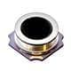</th>
<th><ul>
<li><blockquote>photo_component/image13.jpg

Tracks temperature and barometric pressure

</blockquote></li>
</ul></th>
<th><ul>
<li><blockquote>

Not specifically barometric

</blockquote></li>
</ul></th>
</tr>
<tr class="header">
<th>Option 1</th>
<th><ul>
<li><blockquote>

Customizable setup

</blockquote></li>
</ul></th>
<th><ul>
<li><blockquote>

More expensive

</blockquote></li>
</ul></th>
</tr>
<tr class="odd">
<th>ICP-10125 Pressure Sensor</th>
<th><ul>
<li><blockquote>

Easily replaceable

</blockquote></li>
</ul></th>
<th><ul>
<li><blockquote>

More than half the supply voltage needed for power budget

</blockquote></li>
</ul></th>
</tr>
<tr class="header">
<th colspan="3">$7.35 each</th>
</tr>
<tr class="odd">
<th colspan="3"><a href="https://www.mouser.com/ProductDetail/TDK-InvenSense/ICP-10125?qs=iLbezkQI%252BsjXNGnO2nVjOg%3D%3D"><u>link</u></a></th>
</tr>
</thead>
<tbody>
</tbody>
</table>

<table>
<colgroup>
<col style="width: 33%" />
<col style="width: 33%" />
<col style="width: 33%" />
</colgroup>
<thead>
<tr class="header">
<th>Solution</th>
<th>Pros</th>
<th>Cons</th>
</tr>
<tr class="odd">
<th></th>
<th><ul>
<li><blockquote>

Within the 3.3V operating range.

</blockquote></li>
</ul></th>
<th><ul>
<li><blockquote>

Absolute pressure readings instead of gauge pressure (needs extra calculations done)

</blockquote></li>
</ul></th>
</tr>
<tr class="header">
<th>Option 2</th>
<th><ul>
<li><blockquote>

22,000 g shock survivability

</blockquote></li>
</ul></th>
<th><ul>
<li><blockquote>

Sensitive to electrostatic discharge

</blockquote></li>
</ul></th>
</tr>
<tr class="odd">
<th>LPS22HHTR</th>
<th><ul>
<li><blockquote>

I2C and SPI compatible

</blockquote></li>
</ul></th>
<th><ul>
<li><blockquote>

Complex readout modes

</blockquote></li>
</ul></th>
</tr>
<tr class="header">
<th colspan="3">$4.37 each</th>
</tr>
<tr class="odd">
<th colspan="3"><a href="https://www.digikey.com/en/products/detail/stmicroelectronics/LPS22HHTR/9586578"><u>link</u></a></th>
</tr>
</thead>
<tbody>
</tbody>
</table>

<table>
<colgroup>
<col style="width: 33%" />
<col style="width: 33%" />
<col style="width: 33%" />
</colgroup>
<thead>
<tr class="header">
<th>Solution</th>
<th>Pros</th>
<th>Cons</th>
</tr>
<tr class="odd">
<th>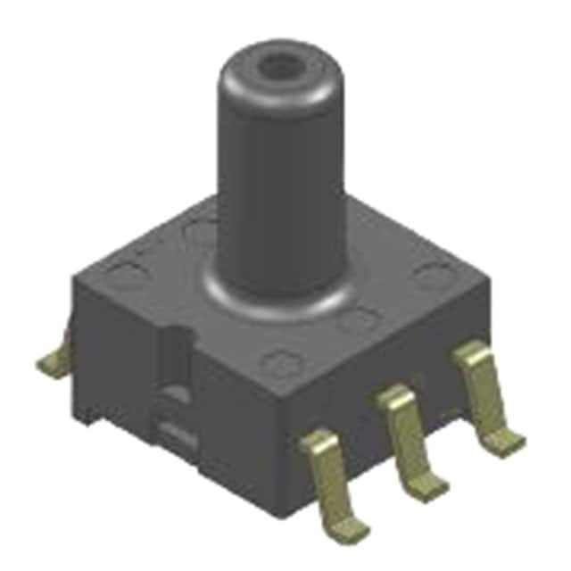</th>
<th><ul>
<li><blockquote>

Low power mode available just in case

</blockquote></li>
</ul></th>
<th><ul>
<li><blockquote>

Readouts based on liquid, not air, requires extra calculations

</blockquote></li>
</ul></th>
</tr>
<tr class="header">
<th>Option 3</th>
<th><ul>
<li><blockquote>

Gives accurate readings

</blockquote></li>
</ul></th>
<th><ul>
<li><blockquote>

Most expensive

</blockquote></li>
</ul></th>
</tr>
<tr class="odd">
<th>DLC-L20G-U2</th>
<th><ul>
<li><blockquote>

High resolution output

</blockquote></li>
</ul></th>
<th><ul>
<li><blockquote>

May give fuzzy barometric pressure readings

</blockquote></li>
</ul></th>
</tr>
<tr class="header">
<th colspan="3">$48.51 per unit</th>
</tr>
<tr class="odd">
<th colspan="3"><a href="https://www.digikey.com/en/products/detail/amphenol-all-sensors-corporation/DLC-L20G-U2/9838292"><u>link</u></a></th>
</tr>
</thead>
<tbody>
</tbody>
</table>

**Choice:** Option 2: LPS22HHTR

**Rationale:** The LPS22HHTR is the most reliable and inexpensive of the
few options available for these types of sensors, and requires the least
amount of calculations to be done in post compared to the other two.
Option 1 would be a good fallback if needed.

**Voltage Regulator**

<table>
<colgroup>
<col style="width: 33%" />
<col style="width: 33%" />
<col style="width: 33%" />
</colgroup>
<thead>
<tr class="header">
<th>Solution</th>
<th>Pros</th>
<th>Cons</th>
</tr>
<tr class="odd">
<th>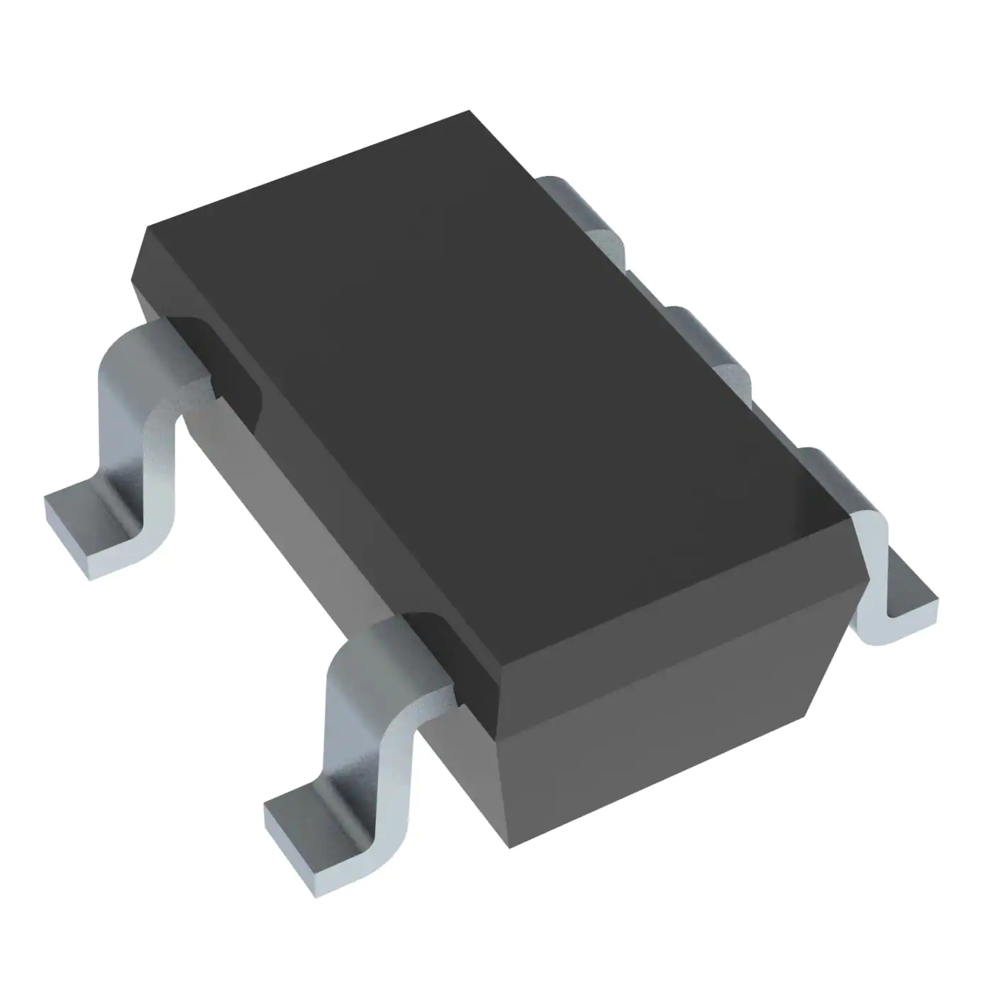</th>
<th><ul>
<li><blockquote>

Supplies fixed voltage

</blockquote></li>
</ul></th>
<th><ul>
<li><blockquote>

Low Stock

</blockquote></li>
</ul></th>
</tr>
<tr class="header">
<th>Option 1</th>
<th><ul>
<li><blockquote>

6 week Lead time

</blockquote></li>
</ul></th>
<th><ul>
<li><blockquote>

Low current output

</blockquote></li>
</ul></th>
</tr>
<tr class="odd">
<th>LM3671MF-3.3/NOPB</th>
<th><ul>
<li><blockquote>

Good operating temperature

</blockquote></li>
</ul></th>
<th><ul>
<li><blockquote>

Low voltage range

</blockquote></li>
</ul></th>
</tr>
<tr class="header">
<th colspan="3">$1.74/each</th>
</tr>
<tr class="odd">
<th colspan="3"><a href="https://www.digikey.com/en/products/detail/texas-instruments/LM3671MF-3-3-NOPB/1590062?utm_adgroup=Texas%20Instruments&amp;utm_source=google&amp;utm_medium=cpc&amp;utm_campaign=Dynamic%20Search_EN_Focus%20Suppliers&amp;utm_term=&amp;utm_content=Texas%20Instruments&amp;gclid=CjwKCAiAuOieBhAIEiwAgjCvcgl6FrHKzpFOkemhengFJNIQXtg4rm4Tnn96wR-nfu4zoRnv-GSeiBoCv-wQAvD_BwE"><u>Link</u></a></th>
</tr>
</thead>
<tbody>
</tbody>
</table>

<table>
<colgroup>
<col style="width: 33%" />
<col style="width: 33%" />
<col style="width: 33%" />
</colgroup>
<thead>
<tr class="header">
<th>Solution</th>
<th>Pros</th>
<th>Cons</th>
</tr>
<tr class="odd">
<th>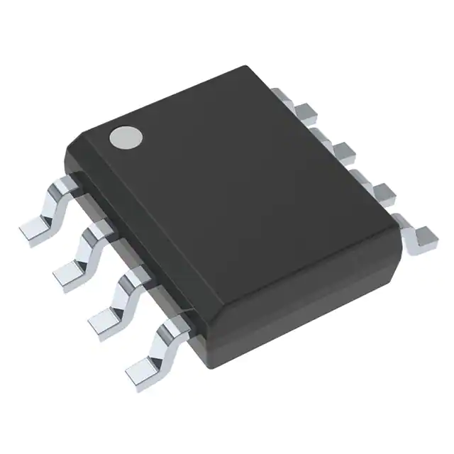</th>
<th><ul>
<li><blockquote>

Good voltage range

</blockquote></li>
</ul></th>
<th><ul>
<li><blockquote>

Expensive

</blockquote></li>
</ul></th>
</tr>
<tr class="header">
<th>Option 1</th>
<th><ul>
<li><blockquote>

Best range in input voltage

</blockquote></li>
</ul></th>
<th><ul>
<li><blockquote>

Low stock

</blockquote></li>
</ul></th>
</tr>
<tr class="odd">
<th>LM2594HVM-5.0/NOPB</th>
<th><ul>
<li><blockquote>

Larger part easier to solder

</blockquote></li>
</ul></th>
<th><ul>
<li><blockquote>

Low current output

</blockquote></li>
</ul></th>
</tr>
<tr class="header">
<th colspan="3">$6.65/each</th>
</tr>
<tr class="odd">
<th colspan="3"><a href="https://www.digikey.com/en/products/detail/texas-instruments/LM2594HVM-5-0-NOPB/363684"><u>Link</u></a></th>
</tr>
</thead>
<tbody>
</tbody>
</table>

<table>
<colgroup>
<col style="width: 33%" />
<col style="width: 33%" />
<col style="width: 33%" />
</colgroup>
<thead>
<tr class="header">
<th>Solution</th>
<th>Pros</th>
<th>Cons</th>
</tr>
<tr class="odd">
<th></th>
<th><ul>
<li><blockquote>

Good voltage range

</blockquote></li>
</ul></th>
<th><ul>
<li><blockquote>

Most expensive

</blockquote></li>
</ul></th>
</tr>
<tr class="header">
<th>Option 1</th>
<th><ul>
<li><blockquote>

Best current output

</blockquote></li>
</ul></th>
<th><ul>
<li><blockquote>

Smaller pins

</blockquote></li>
</ul></th>
</tr>
<tr class="odd">
<th>LM2596S-3.3/NOPB</th>
<th><ul>
<li><blockquote>

High stock

</blockquote></li>
</ul></th>
<th><ul>
<li><blockquote>

May be difficult to solder

</blockquote></li>
</ul></th>
</tr>
<tr class="header">
<th colspan="3">$1.141/each</th>
</tr>
<tr class="odd">
<th colspan="3"><a href="https://www.digikey.com/en/products/detail/texas-instruments/LM2596S-3-3-NOPB/363704?utm_adgroup=Texas%20Instruments&amp;utm_source=google&amp;utm_medium=cpc&amp;utm_campaign=Dynamic%20Search_EN_Focus%20Suppliers&amp;utm_term=&amp;utm_content=Texas%20Instruments&amp;gclid=CjwKCAiAuOieBhAIEiwAgjCvcv1RQACvc7eoyc5kEUeOsHC-rdM7IOU5Q3M5odXNLbipteF3X3QPeBoCF1kQAvD_BwE"><u>Link</u></a></th>
</tr>
</thead>
<tbody>
</tbody>
</table>

**Choice:** LM2596S-3.3/NOPB

**Rationale:** Best choice in terms of operation and for what our design
needs. May be a bit on the expensive side but it covers all the bases
where some of the other components fall a bit short with good stock
availability. .

## Motor System - Tilak

**Motor Driver**

<table>
<colgroup>
<col style="width: 33%" />
<col style="width: 33%" />
<col style="width: 33%" />
</colgroup>
<thead>
<tr class="header">
<th>
<strong>Solution</strong>

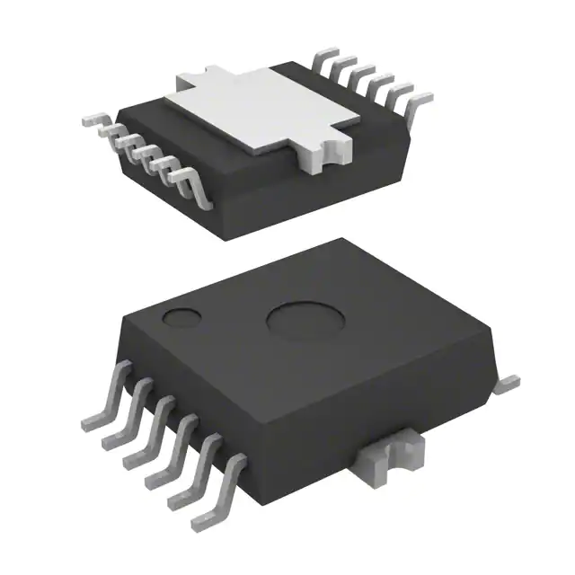

Option 1

IFX9201SGAUMA1

DC H Bridge Driver

$4.88/each

<a href="https://www.digikey.com/en/products/detail/infineon-technologies/IFX9201SGAUMA1/5415542"><u>From Digikey</u></a>
</th>
<th>
<strong>Pros</strong>

<ul>
<li><blockquote>

Supports SPi

</blockquote></li>
<li><blockquote>

Can operate at 3.3V logic levels

</blockquote></li>
<li><blockquote>

Includes internal flyback diodes

</blockquote></li>
</ul></th>
<th>
<strong>Cons</strong>

<ul>
<li><blockquote>

No physical heatsink

</blockquote></li>
<li><blockquote>

Requires heatsink pad on PCB

</blockquote></li>
</ul></th>
</tr>
<tr class="odd">
<th><h1 id="section">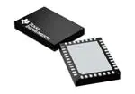</h1>

Option 2

MCF8315A1VRGFR

DC H Bridge Driver

$4.50/each

<a href="https://www.mouser.com/ProductDetail/Texas-Instruments/MCF8315A1VRGFR?qs=rQFj71Wb1eW9Q9rSU7C3NQ%3D%3D"><u>From Mouser</u></a>
</th>
<th><ul>
<li><blockquote>

FOC controller Three-phase BLDC motor driver

</blockquote></li>
<li><blockquote>

Anti-voltage surge (AVS) protection

</blockquote></li>
</ul></th>
<th><ul>
<li><blockquote>

Does not support SPI

</blockquote></li>
</ul></th>
</tr>
<tr class="header">
<th>

Option 3

BD6210HFP-TR

DC H Bridge Driver

$1.99/each

<a href="https://www.digikey.com/en/products/detail/rohm-semiconductor/BD6210HFP-TR/1936301"><u>From Digikey</u></a>
</th>
<th><ul>
<li><blockquote>

Cheap

</blockquote></li>
<li><blockquote>

VREF Voltage Setting Pin Enables PWM Duty Control

</blockquote></li>
</ul></th>
<th><ul>
<li><blockquote>

Does not support SPI

</blockquote></li>
</ul></th>
</tr>
</thead>
<tbody>
</tbody>
</table>

**Choice:** Option 1: IFX9201SGAUMA1

**Rationale:** SPI is only provided in the above motor driver. Also
includes a flyback diode.
