# Weather Protective Cover
* Team 302
* 2/27/2023
* ASU EGR 314: Embedded Sys Design Project II
* Prof. Kelley

## Table of Content
* Introduction
* Presentation

Table of content

 
  * Team Organization
  * User needs, Benchmarking, and Requirement
  * Design Ideation
  * Selected Design
  * Block Diagram
  * Component Selection
  * MicroController Selection
  * Hardware Proposal
  * Software Proposal
  * Power Budget
  * Appendex
  

## Presentation

<iframe width="560" height="315" src="https://www.youtube.com/embed/XPlsDYkBCSw" title="YouTube video player" frameborder="0" allow="accelerometer; autoplay; clipboard-write; encrypted-media; gyroscope; picture-in-picture; web-share" allowfullscreen></iframe>

## Introduction
Every year in the United States there are at least 10,000 storms that have hail big enough to damage solar panels. With the growth of solar panels, the risk of them getting damaged by these hail storms and other debris increases. Team 302's goal is to be able to sovle this issue.

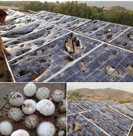
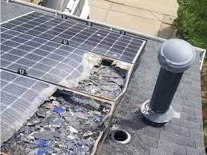

## Team Organization
Team 302’s goal is to be able to make a fully functioning product that meets the requirements, solves the problem given,  is within our budget, and is able to provide measurements related to its environment defined by the user.

[Our charter](/team-302-team-charter.md)
## User needs, Benchmarking, and Requirements

After team 302 established our organization, the team then gathered eight different products that can be used to benchmark existing products and to gather user needs based on the reviews of the benchmarked products. The team was able to gather together the user needs. (See the below link)

After we had found enough user needs, we decided to sort them into three groups based on our constraints:
* Installation and use
* Longevity
* Other related device standards

After we sorted our user needs, we then decided to rank them based on the importance of these needs with the requirements of the project brief.

Based off of our benchmarking the closest products that were found were adding addition glass to the panels and using hail car covers.

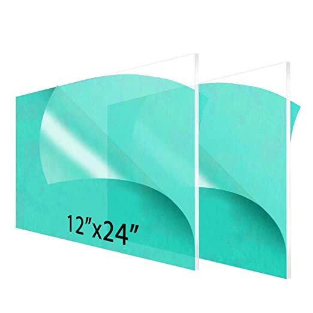

[link to user needs, Benchmarking, and Requirements](/User-Needs.md)

## Design Ideation

For our brainstorming, each team member came up with 25 ideas that they had based on their own ideas: what they saw in the benchmarking, and the ideas of the other team members. We used a jamboard to organize their thoughts and allow all team members to see all ideas that the other members had written down. The team then combined different ideas together that worked with the constraints, and in the end they were able to create three different designs out of them.

The Solar panel protection design, by Tyler Winder.

The Weather Station Glider design, by Tilak Rai Thanga Rai.

The Automated AC Unit Cover design, by Jose Nava-Mesina.

[link to design ideation](/design-ideation.md)

## Selected Design

The design that we chose was the solar panel protector. This design consists of a self-contained device that is installed next to the solar panel that, when it detects conditions that cause storms that would produce strong winds or hail, it will then activate a motor that will unroll a stored protective covering over the solar panel in order to protect it from the hail, rain, and other storm debris. The device also has a retractable top that will cover the sensors and protect them as well. The lid will raise up and allow the sensors to detect the weather conditions every hour before lowering it again. The design for this protector can be seen below.

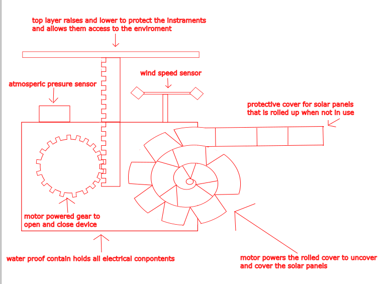

[Link](/Selected_design.png)

## Block Diagram

After selecting the design the team then broke down the design into subsystems and created the following block diagram.

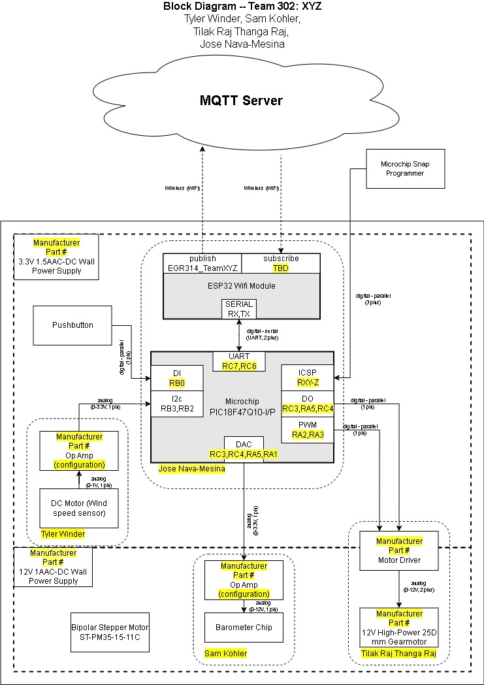

[Link](/Block_Diagram.jpg)

## Component Selection

The team researched the different components that would be needed for making this product.

**Wind Sensor**

* ADC: ADC081C027
* This ADC has the best input voltage range, temperature range, and is the cheapest of the three. 

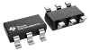

* Op Amp: OPA2310IDR
* The reason we are choosing this one is it does have two channels which we can use both sensors through it.

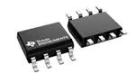

* DC Generator: MM10 DC Motor
* This product is currently available to us for free and it does work with previous testing.

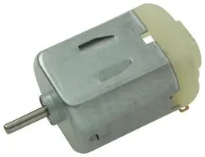

**Barometric Pressure Sensor**

*  Barometric Pressure Sensor: KP235XTMA2
*  The KP235XTMA2 is the most reliable and inexpensive of the few options available for these types of sensors, and requires the least amount of calculations to be done in post compared to the other two.

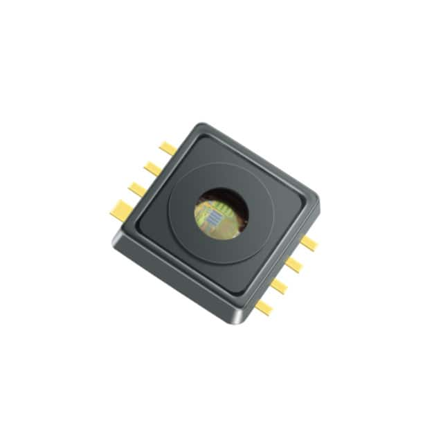

**Voltage Regulator**

* Voltage Regulator: LM2596S-3.3/NOPB
* Best choice in terms of operation and for what our design needs. May be a bit on the expensive side but it covers all the bases where some of the other components fall a bit short with good stock availability. 

**Motor System**

* Motor Driver: IFX9201SGAUMA1
* SPI is only provided in the above motor driver. Also includes a flyback diode.

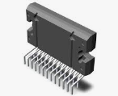

* Motor: NF103G-301

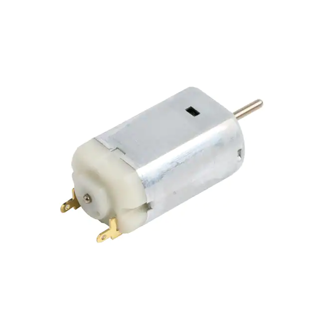

[Link to the full component selection](/Component_Selection_Team_302.md)

## Microcontroller Selection

After reviewing and studying the different Microcontrollers that were available to the team they decided to go with the PIC18F27Q10. They choose this pic because it as similar to the PIC microcontrol that is used for class work, it contains more then enough pins for the team to use, and contains both I2C and SPI communication pins.

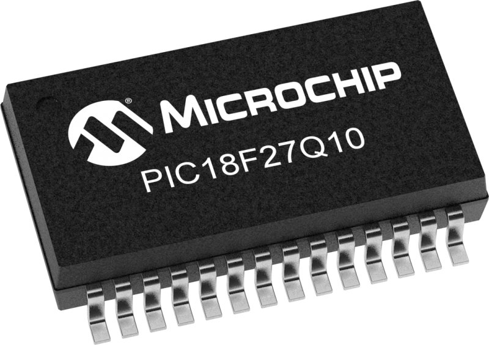

[Link to the full Microcontroller Selection](microcontroller-selection-table-team-302.md)

## Hardware Proposal

The team created the following schematics for the following subsystems based on the subsystems created in the block diagram.

**Actuator Subsystem**

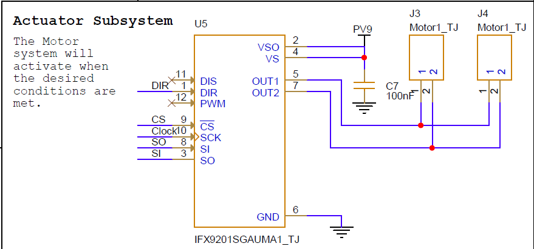

[Link](/Actuator_subsystem2.png)

**Barometric Pressure Sensor**

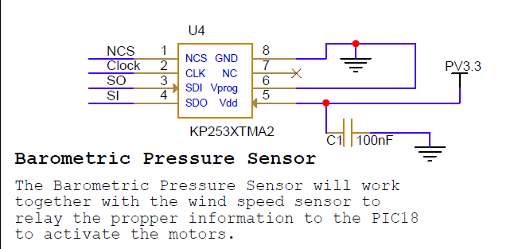

[Link](/Barometric_Pressure_sensor3.png)

**Wind Sensor**

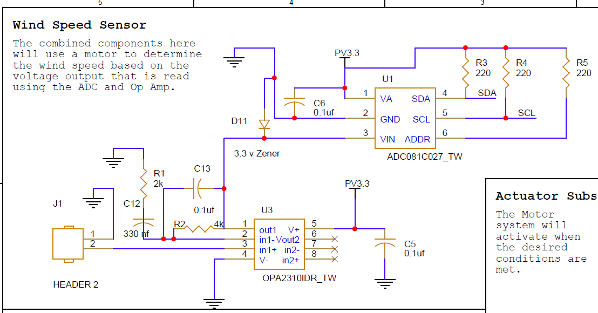

[Link](/wind_sensor_schematic2.png)

**MicroController and Voltage Regulator**

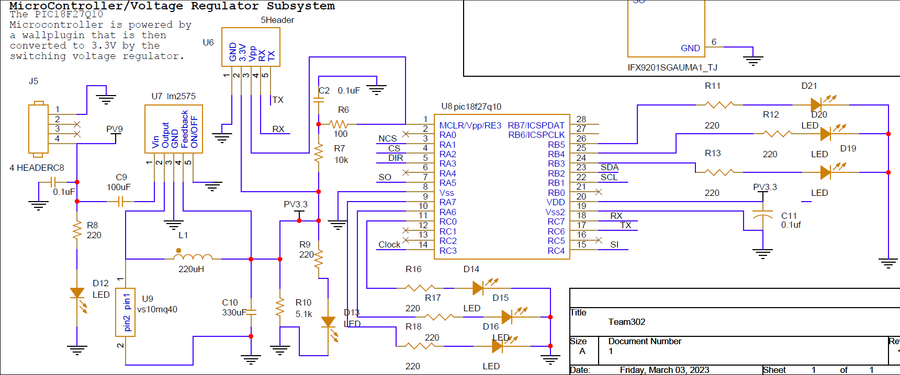

[Link](/MicroController_VoltageRegulatorSubsystem3.png)

**Full team Schematic**
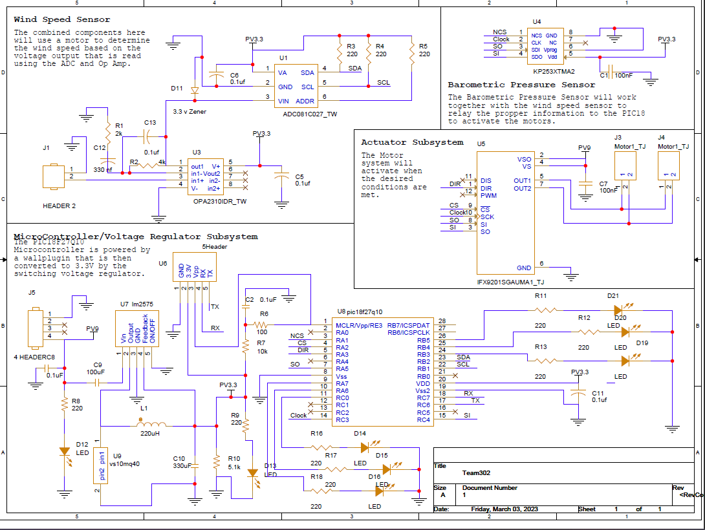

[Link](/MicroController_VoltageRegulatorSubsystem4.png)

## Software Proposal

We will be using Mplab and MCC to program our microcontroller.

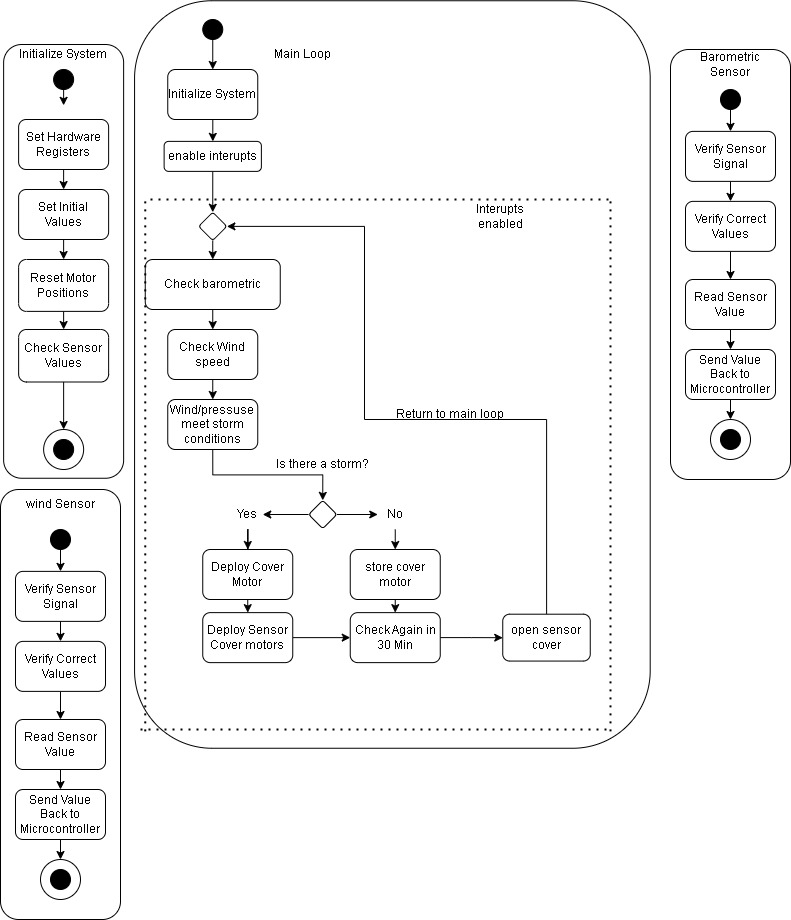

[Link](/Software_Proposal2.jpg)

## Power Budget

[Link](/Power_Budget-Power_Budget.md)

## appendix
[appendix](/team-302-team-charter.md)
