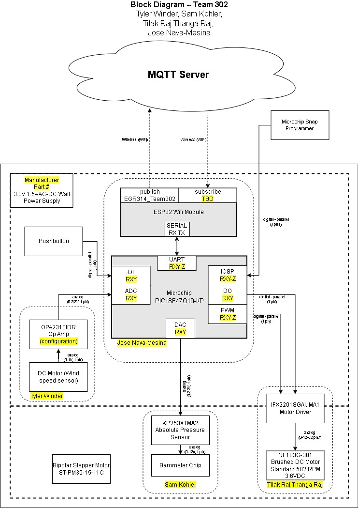
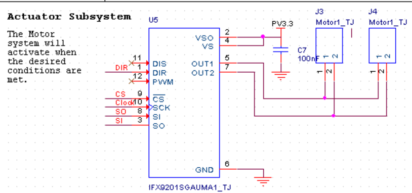
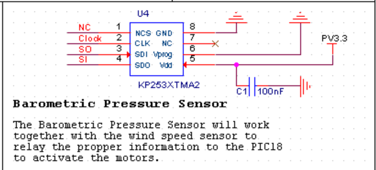
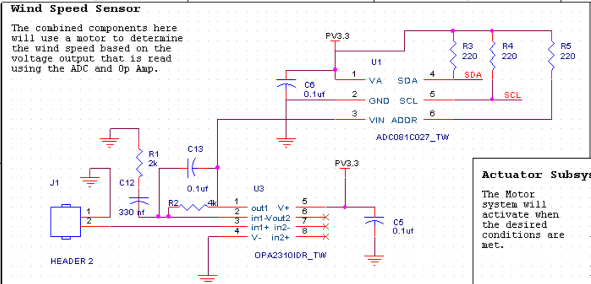
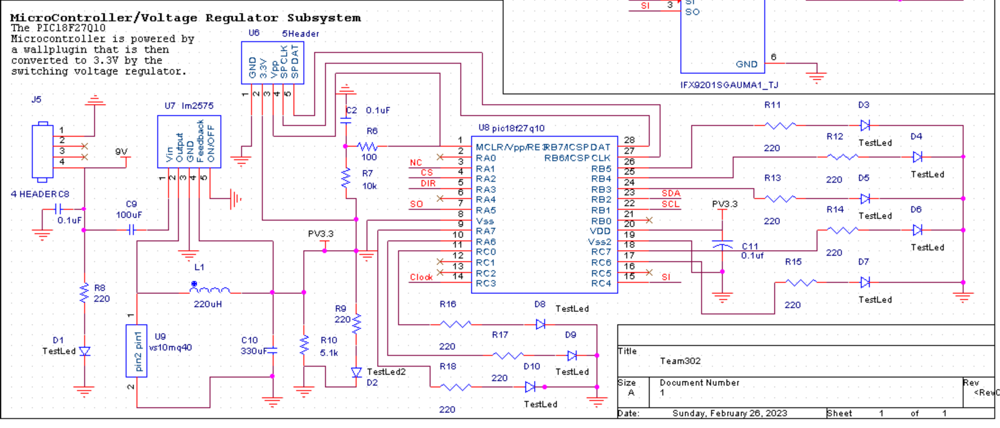
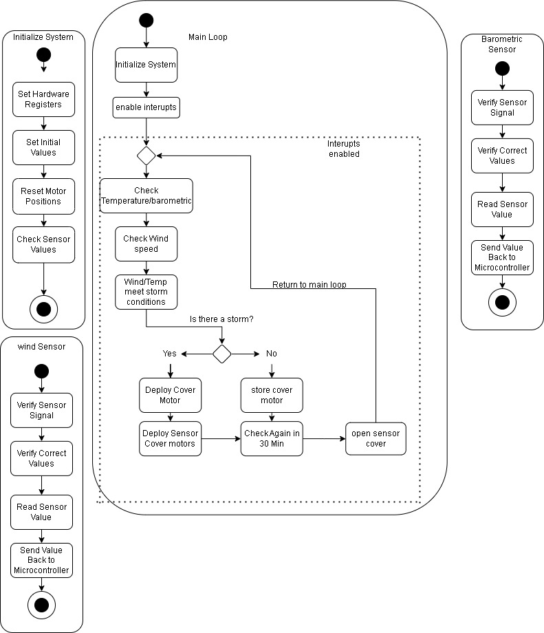

# Weather protective cover
* Team 302
* 1/23/2023
* ASU EGR 314: Embedded Sys Design Project II
* Prof. Kelley

## Team Organization
Team 302’s goal is to be able to make a fully functioning product that meets the requirements, solves the problem given,  is within our budget, and is able to provide measurements related to its environment defined by the user.

[link to team charter](/team-302-team-charter.md)
## User needs, Benchmarking, and Requirments

After team 302 established our organization, the team then gathered eight different products that can be used to benchmark existing products and to gather user needs based on the reviews of the benchmarked products.The team was able to gather together the user needs seen in the below link.

After the team had their user needs they decide to sort them into three groups.
* Installation and use
* Longevity
* Other device standards

After the team sorted their user needs they then decided to rank them based on the importance of these needs with the requirements of the project.

[link to user needs, Benchmarking, and Requirments](/User-Needs.md)

## Design Ideation

For the team's brianstroming each team member came up with 25 ideas that they had, based on their own ideas, what they saw in the benchmarking, and the ideas of the other team membmers. The team used jamboard to organize their thoughts and allow all team members to see all ideas that the other members had written down. The team then combined differnet ideas together that workd and in the end they were able to create three different designs.

The Solar panel protection design was drawn up by Tyler Winder.

The Weather Station Glider design was drawn up by Tilak Rai Thanga Rai.

The Automated AC Unit Cover design was drawn up by Jose Nava-Mesina.

[link to design ideation](/design-ideation.md)

## Presentation

<iframe width="560" height="315" src="https://www.youtube.com/embed/XPlsDYkBCSw" title="YouTube video player" frameborder="0" allow="accelerometer; autoplay; clipboard-write; encrypted-media; gyroscope; picture-in-picture; web-share" allowfullscreen></iframe>

## Selected Design

The design that the team choose is the solar panel protector. This design consistes of a self contained device that is installed next to the solar panel that when it detects conditions that cause storms that would produce strong winds or hail. This device will then activate a motor that will unroll a stored protective covering over the solar panel inorder to protect it from hail and other storm debris. The device also has a retractable top that will cover the sensors and protect them from hail, debris, and strong winds. The lid will raise up and allow the sensors to detect the weather conditions every hour before the lid will lower again. The design can be seen below.

## Block Diagram

After selecting the design the team then broke down the design into subsystems and created the following block diagram.

## Component Selection

The team researched the different components that would be needed for making this product.

**Wind Sensor**

* ADC: ADC081C027
* Op Amp: OPA2310IDR
* DC Generator: MM10 DC Motor

**Barometric Pressure Sensor**

*  Barometric Pressure Sensor: LPS22HHTR

**Voltage Regulator**

* Voltage Regulator: LM2596S-3.3/NOPB

**Motor System**

* Motor Driver: FX9201SGAUMA1
* Motor: NF103G-301

[Link to the full component selection](/Component_Selection_Team_302.md)

## Microcontroller Selection

After reviewing and studying the different Microcontrollers that were available to the team they decided to go with the PIC18F27Q10. They choose this pic because it as similar to the PIC microcontrol that is used for class work, it contains more then enough pins for the team to use, and contains both I2C and SPI communication pins.

[Link to the full Microcontroller Selection](microcontroller-selection-table-team-302.md)

## Hardware Proposal

The team created the following schematics for the following subsystems based on the subsystems created in the block diagram.

**Actuator Subsystem**

**Barometric Pressure Sensor**

**Wind Sensor**

**MicroController and Voltage Regulator**

## Software Proposal

## Power Budget

## appendix
[appendixa](/team-302-team-charter.md)
