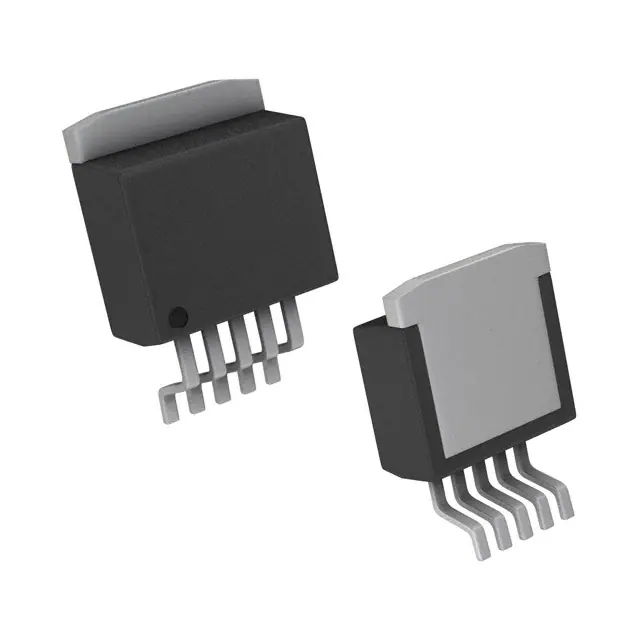
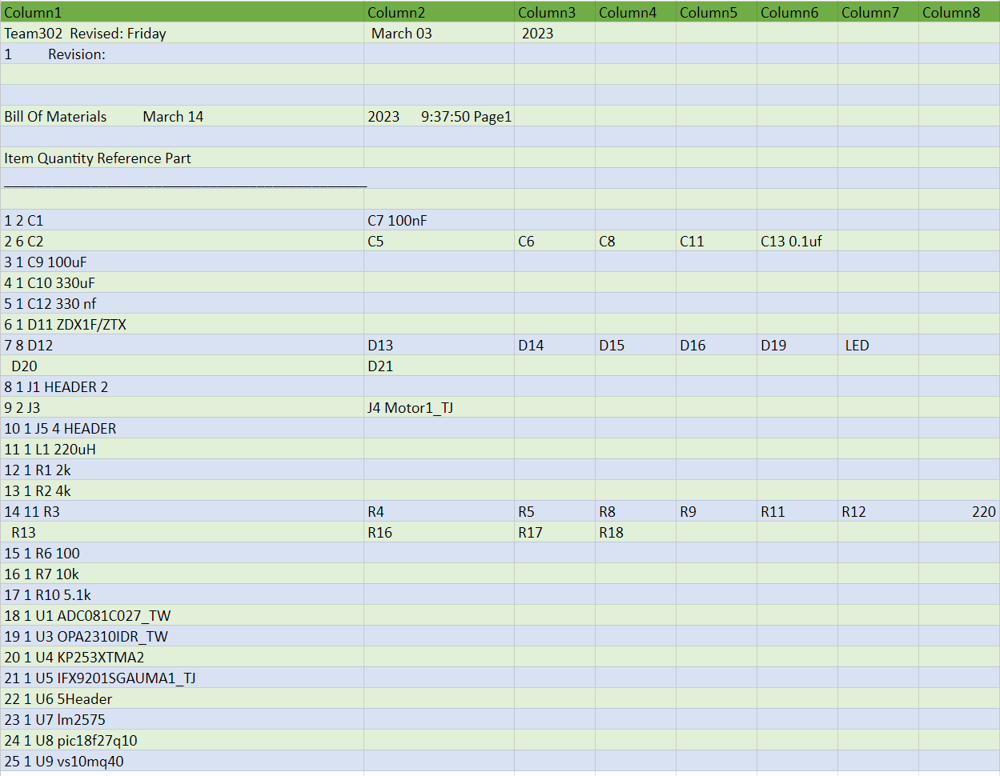

# Weather Protective Cover
* Team 302
* 4/28/2023
* ASU EGR 314: Embedded Sys Design Project II
* Prof. Kelley

## Table of Content
* Introduction
* Presentation

expand

 
* Team Organization
   
* User needs, Benchmarking, and Requirement
   
* Design Ideation
   
* Selected Design
   
* Block Diagram
   
* Component Selection
   
* MicroController Selection
   
* Hardware Proposal
   
* Software Proposal
   
* Power Budget
   
* Appendex
   

## Presentation

<iframe width="560" height="315" src="https://www.youtube.com/embed/XPlsDYkBCSw" title="YouTube video player" frameborder="0" allow="accelerometer; autoplay; clipboard-write; encrypted-media; gyroscope; picture-in-picture; web-share" allowfullscreen></iframe>

## Introduction
Every year in the United States there are at least 10,000 storms that have hail big enough to damage solar panels. With the growth of solar panels, the risk of them getting damaged by these hail storms and other debris increases. Team 302's goal is to be able to sovle this issue.

## Team Organization
Hailstorms and other debris can be a significant threat to the integrity of solar panels, leading to substantial damage and financial losses. With the rise in the use of solar panels across the United States, the risk of damage caused by hail and other debris is also increasing. According to recent estimates, there are at least 10,000 storms every year in the United States that produce hail large enough to cause damage to solar panels. This underscores the need for effective solutions that can mitigate the damage caused by these storms and debris.

In light of these challenges, Team 302 aims to develop innovative solutions to address this issue. They recognize that developing a solution that can effectively protect solar panels from damage caused by hail and other debris is critical to ensuring the longevity and reliability of solar panels. Their efforts could significantly reduce the risks and costs associated with the maintenance and repair of solar panels, while also increasing their overall efficiency.
[Our charter](/team-302-team-charter.md)

## User needs, Benchmarking, and Requirements

After establishing the organization, team 302 realized the importance of understanding user needs in developing successful products. To achieve this, the team gathered eight different products that are similar to their target products and can be used to benchmark existing products. By benchmarking, the team was able to evaluate and compare the features of their target products to the market competitors, which provided insights into the strengths and weaknesses of their target products.

Through the benchmarking process, the team also gathered user needs by analyzing the reviews of the benchmarked products. This helped the team to understand the key requirements of their potential customers and what they expect from similar products.

Once the team had gathered enough user needs, they grouped them into three categories based on the constraints that they faced. These categories were installation and use, longevity, and other related device standards. By grouping the user needs, the team was able to focus on specific areas and prioritize the requirements that were most important to their target customers.

The installation and use category focused on the ease of setting up and using the product. The longevity category focused on the durability and lifespan of the product. Finally, the other related device standards category focused on the compatibility and integration of the product with other devices in the market.

By sorting the user needs into these three categories, the team was able to ensure that they were addressing the most critical requirements of their target customers while considering the constraints that they had to work with. This approach helped the team to develop a product that not only met the user needs but also aligned with their organization's goals and objectives.

[link to user needs, Benchmarking, and Requirements](/User-Needs.md)

## Design Ideation

During our brainstorming session, every team member generated 25 ideas based on their own insights, observations from benchmarking, and suggestions from other team members. We utilized a jamboard to compile and display these ideas, ensuring that every team member could view all of them. Subsequently, we merged compatible ideas together while taking into account the relevant constraints, ultimately resulting in three distinct designs.

The Solar panel protection design, by Tyler Winder.

The Weather Station Glider design, by Tilak Rai Thanga Rai.

The Automated AC Unit Cover design, by Jose Nava-Mesina.

[link to design ideation](/design-ideation.md)

## Selected Design

We opted for the solar panel protector as our chosen design. This design comprises a self-contained unit that is installed adjacent to the solar panel. When it detects weather conditions that are likely to cause strong winds or hail, the device will activate a motor to unfurl a protective covering over the solar panel, safeguarding it against damage from hail, rain, and other storm debris. Additionally, the unit has a retractable lid that shields the sensors from the elements. The lid will raise every hour, allowing the sensors to assess the weather conditions before closing again. The design of this protector is depicted below.

[Link](/Selected_design.png)

## Block Diagram

After selecting the design the team then broke down the design into subsystems and created the following block diagram.

[Link](/Block_Diagram.jpg)

## Component Selection

The team researched the different components that would be needed for making this product.

**Wind Sensor**

* ADC: ADC081C027
* This ADC has the best input voltage range, temperature range, is the cheapest of the three, and has a higher sample rate of 189 kSPS.

* Op Amp: OPA2310IDR
* The reason we are choosing this one is that it has a lower input offset voltage, a higher bandwidth, a rail-to-rail input and output, and a lower power consumption.

* DC Generator: MM10 DC Motor
* This product is currently available to us for free, has a higher torque output, has a higher efficiency rating, is designed for continuous use.

**Barometric Pressure Sensor**

*  Barometric Pressure Sensor: KP253XTMA2
*  The KP253XTMA2 is a piezoresistive pressure sensor with a wide pressure range and a high accuracy. It is designed for harsh environments and can operate at temperatures ranging from -40°C to 125°C.

**Voltage Regulator**

* Voltage Regulator: LM2596S-3.3/NOPB
* Best choice in terms of operation and for what our design needs. May be a bit on the expensive side but it covers all the bases where some of the other components fall a bit short with good stock availability. It also has a high efficiency (up to 85%) and can operate over a wide input voltage range (4.5V to 40V).

**Motor System**

* Motor Driver: IFX9201SGAUMA1
* The IFX9201SGAUMA1 is a highly integrated H bridge driver that provides a number of benefits, such as high efficiency, low power consumption, and high reliability. It also has built-in protection features such as over-temperature protection, over-voltage protection, and short-circuit protection.

[Link to the full component selection](/Component_Selection_Team_302.md)

## Microcontroller Selection

After reviewing and studying the different Microcontrollers that were available to the team they decided to go with the PIC18F27Q10. They choose this pic because it has a higher maximum operating frequency of 64 MHz, has a larger program memory of 128 KB, and has a higher number of input/output (I/O) pins.

[Link to the full Microcontroller Selection](microcontroller-selection-table-team-302.md)

## Hardware Proposal

The team by gathering and analyzing user needs and benchmarking existing products in the market, the team was able to develop a weather protective cover with a barometric pressure sensor and a wind sensor that met the critical requirements of their target customers. The team's approach to sorting user needs into three categories based on installation and use, longevity, and related device standards allowed them to prioritize the most critical requirements while considering the constraints they faced. The resulting product not only met the user needs but also aligned with the organization's goals and objectives. They created the following schematics for the following subsystems based on the subsystems created in the block diagram.

**Motor Subsystem**

[Link](/Actuator_subsystem2.png)

**Barometric Pressure Sensor**

[Link](/Barometric_Pressure_sensor3.png)

**Wind Sensor**

[Link](/temp.png)

**MicroController and Voltage Regulator**

[Link](/Micro.png)

**ESP32**

[Link](/esp32.png)

**Full team Schematic**

[Link](/fin.png)

With the insights gained from the user needs analysis and benchmarking, the team can now focus on improving their product to meet the evolving needs of their customers. One of the improvements they can make is to release a new version, v2, of their product.

Based on the feedback and insights gathered from the user needs analysis, the team can make several changes to their v2 product to better meet their customers' requirements. One of the changes is to switch the So pin from RA5 to RC2. This change can improve the product's compatibility with other devices commonly used in the industry, making it easier for customers to integrate the product into their existing setup.

Another change that the team can make is to fix pin one on the voltage regulator so that the pin connects to power and the capacitor connects to ground. This change can improve the durability and lifespan of the product, ensuring that it can withstand harsh weather conditions and provide reliable protection from the elements.

Furthermore, the team can switch the motors for ones that have more torque. This change can improve the product's performance, making it more efficient and effective in its operation. Customers will appreciate the increased functionality and reliability of the product.

Overall, by making these changes, the team can release a v2 product that meets the evolving needs of their customers, improves the compatibility and durability of the product, and enhances its performance. The team can continue to gather feedback and insights from their customers to inform future iterations of the product, ensuring that they are meeting the most critical requirements of their target market.

**PCB Design**

[Link](/PCBdesign.png)

**Front**

[Link](/frontreal.jpg)

**Back**

[Link](/backreal.jpg)

## Software Proposal

We will be using Mplab and MCC to program our microcontroller.

[Link](/Software_Proposal2.jpg)

The weather station features a cover that protects it from environmental factors such as rain and wind. Users can view the status of the cover, which indicates whether it is open or closed. Additionally, the weather station records real-time data of current weather readings such as temperature, humidity, air pressure, and wind speed. Users can view this data to stay informed about the current weather conditions. They can also view retime data of the current weather readings to get a better understanding of how the weather is changing over time.

The software design for a weather protective cover for solar panels underwent several significant changes to ensure reliable and efficient operation. One of the most significant changes was the addition of an ESP32 module to provide real-time weather data. This allowed the cover to adjust its position based on the current weather conditions, such as wind speed and precipitation, to provide maximum protection for the solar panels.

Another significant change was the use of correct I2C communication and SPI communication protocols to ensure accurate and consistent communication between the various components of the system. This improved the overall reliability of the system and reduced the risk of communication errors that could lead to malfunction or damage.

The third major change was the ability for the sensors to control the motor, enabling the cover to automatically adjust its position in response to changes in the environment. For example, the cover could detect changes in sunlight intensity and adjust its position to optimize energy collection.

A fourth major change was the addition of a timer to prevent the cover from sliding open and close every few seconds. This timer allowed the cover to remain closed during periods of inclement weather, improving the protection provided to the solar panels and reducing the risk of damage.

Overall, these changes significantly improved the functionality and reliability of the weather protective cover for solar panels, ensuring that the panels are protected from harsh weather conditions while maximizing energy collection.

To improve the software design for the weather protective cover for solar panels, there are several steps that can be taken. Firstly, the software should allow the user to open or close the cover via the ESP32. This will provide the user with greater control over the cover, allowing them to adjust it as necessary based on changing weather conditions.

Secondly, the sensors used to monitor weather conditions should be calibrated to be more accurate. This will ensure that the cover is opened and closed at the right time to protect the solar panels from the elements. The software should be designed to allow for easy calibration of the sensors, so that users can adjust them as necessary to ensure accurate readings.

Finally, the software should include a cleaning feature that allows users to set a schedule for cleaning the solar panels. This will help to ensure that the panels are free from dirt and debris, which can impact their performance. The cleaning feature should be customizable, allowing users to set the frequency and duration of cleaning cycles.

By incorporating these features into the software design, the weather protective cover for solar panels can be made more effective and user-friendly. It will provide users with greater control over the cover and ensure that the panels are protected from the elements, maximizing their performance and lifespan.

**Recommendations for future students**

1. Learn as much C and Python as you can outside of this class.
1. Brush up on wiring and breadboarding, as well as learn about different protocols such as SPI and I2C.
1. Prioritize this class heavily, as assignments are almost back-to-back weekly with little to no breaks in between. It is more intense than EGR 304.
1. Practice soldering as much as possible to improve your PCB design and parts placement skills.
1. Attend office hours and seek help from the professor or TA early on if you're struggling. Also, form study groups with your peers and work on problem sets together to better understand the material and stay on track.

## appendix

**Power Budget**

[Link](/Power_Budget-Power_Budget.md)

**System Verification**

[Link](/table.png)

**Team Charter**
[Link](/team-302-team-charter.md)

**Build of Materials**

[Link](/BillofMaterials.xlsx)
